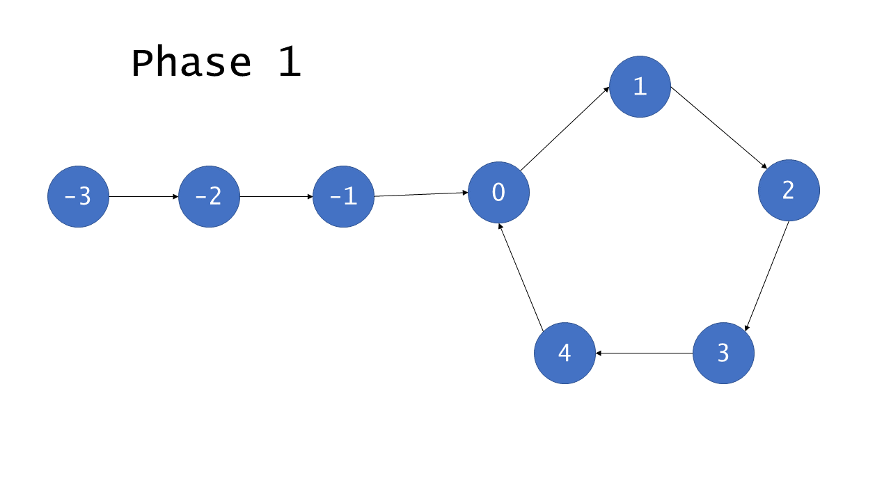

# 自己写的

```java
public class Solution {
    public ListNode detectCycle(ListNode head) {
        Set<ListNode> set = new HashSet<>();
        while(head != null){
            if (set.contains(head)) {
                return head;
            }
            set.add(head);
            head = head.next;
        }
        return null;
    }
}
```

# 题解

Floyd 的算法被划分成两个不同的 阶段 。在第一阶段，找出列表中是否有环，如果没有环，可以直接返回 null 并退出。否则，用 **相遇节点** 来找到环的入口。
- 阶段一

    这里我们初始化两个指针 - 快指针和慢指针。我们每次移动慢指针一步、快指针两步，直到快指针无法继续往前移动。如果在某次移动后，快慢指针指向了同一个节点，我们就返回它。否则，我们继续，直到 while 循环终止且没有返回任何节点，这种情况说明没有成环，我们返回 null 。

    

    环中的节点从 `$0$` 到 `$C-1$` 编号，其中 `$C$` 是环的长度。非环节点从 `$−F$` 到 `$−1$` 编号，其中 `$F$` 是环以外节点的数目。 `$F$` 次迭代以后，慢指针指向了 0 且快指针指向某个节点 `$h$` ，其中 `$F \equiv h \pmod C$` 。这是因为快指针在 `$F$` 次迭代中遍历了 `$2F$` 个节点，且恰好有 `$F$` 个在环中。继续迭代 `$C−h$` 次，慢指针显然指向第 `$C−h$` 号节点，而快指针也会指向相同的节点。原因在于，快指针从 `$h$` 号节点出发遍历了 `$2(C−h)$` 个节点。

    ```math
    \begin{aligned}
    h + 2(C-h) &= 2C-h\\
    & C-h (mod C)
    \end{aligned}
    ```

    因此，如果列表是有环的，快指针和慢指针最后会同时指向同一个节点，因此被称为 相遇 。

- 阶段二

    给定阶段 1 找到的相遇点，阶段 2 将找到环的入口。首先我们初始化额外的两个指针： ptr1 ，指向链表的头， ptr2 指向相遇点。然后，我们每次将它们往前移动一步，直到它们相遇，它们相遇的点就是环的入口，返回这个节点。

    下面的图将更好的帮助理解和证明这个方法的正确性。

    

    我们利用已知的条件：慢指针移动 1 步，快指针移动 2 步，来说明它们相遇在环的入口处。（下面证明中的 tortoise 表示慢指针，hare 表示快指针）

    ```math
    \begin{aligned}
    2 * distance(tortoise) &= distance(hare)\\
    2(F+a)&=F+a+b+a\\
    2F+2a &=F+2a+b\\
    F&=b
    \end{aligned}
    ```

    因为 `$F=b$` ，指针从 `$h$` 点出发和从链表的头出发，最后会遍历相同数目的节点后在环的入口处相遇。

```java
public class Solution {
    public ListNode detectCycle(ListNode head) {
        // 找出相遇节点
        ListNode tortoise = head, hare = head, meet = null;
        while (hare != null && hare.next != null) {
            hare = hare.next.next;
            tortoise = tortoise.next;

            if (hare == tortoise) {
                meet = tortoise;
                break;
            }
        }

        if (meet == null)
            return null;

        tortoise = head;
        while (tortoise != hare){
            hare = hare.next;
            tortoise = tortoise.next;
        }
        return tortoise;
    }
}
```