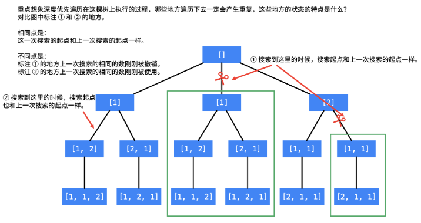
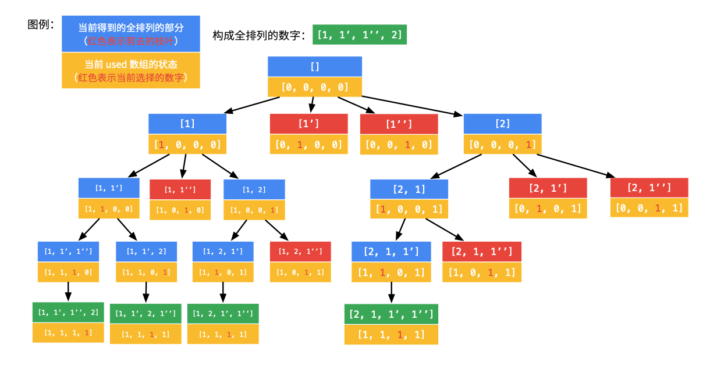
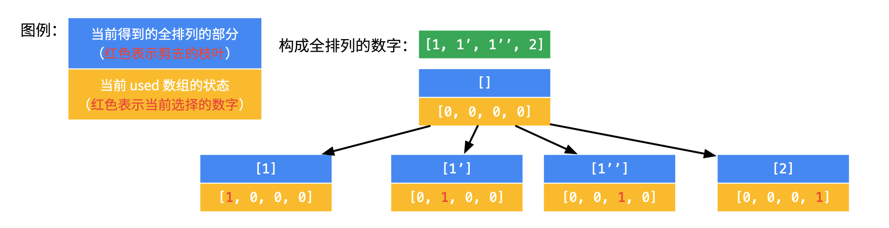
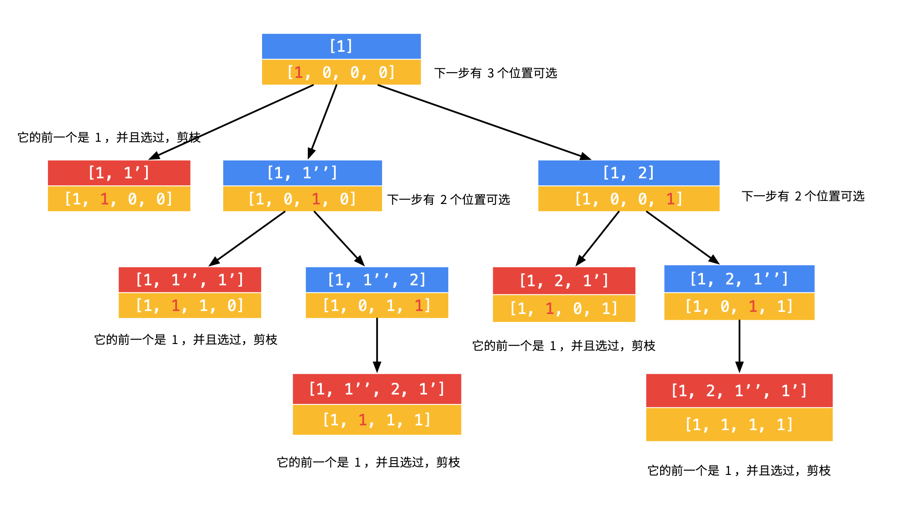
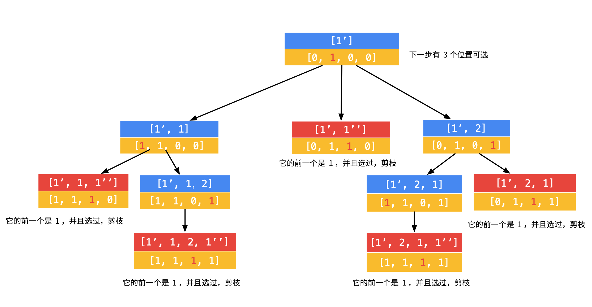
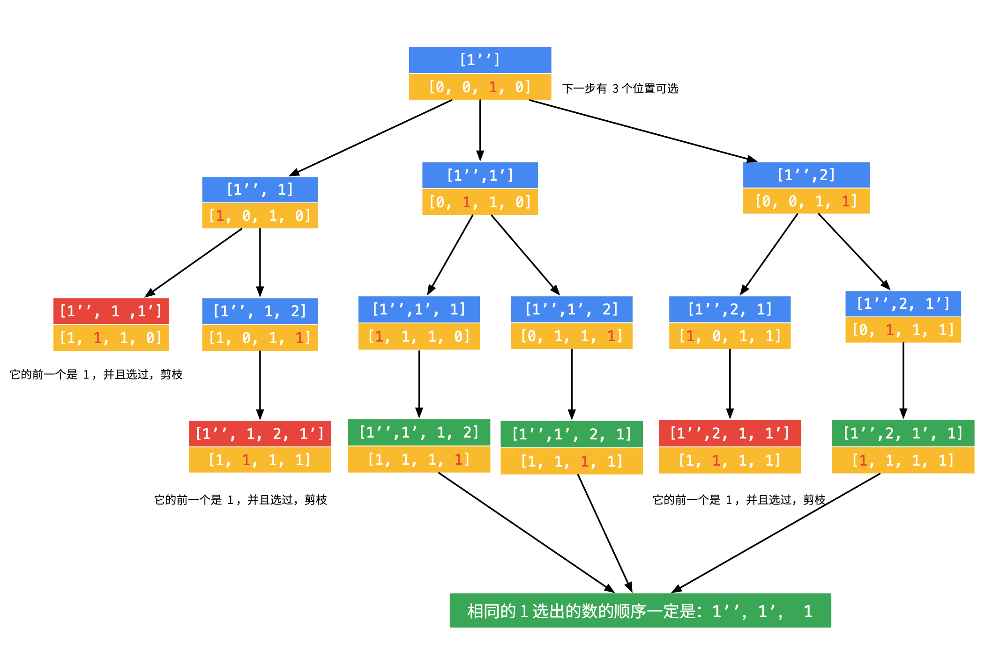
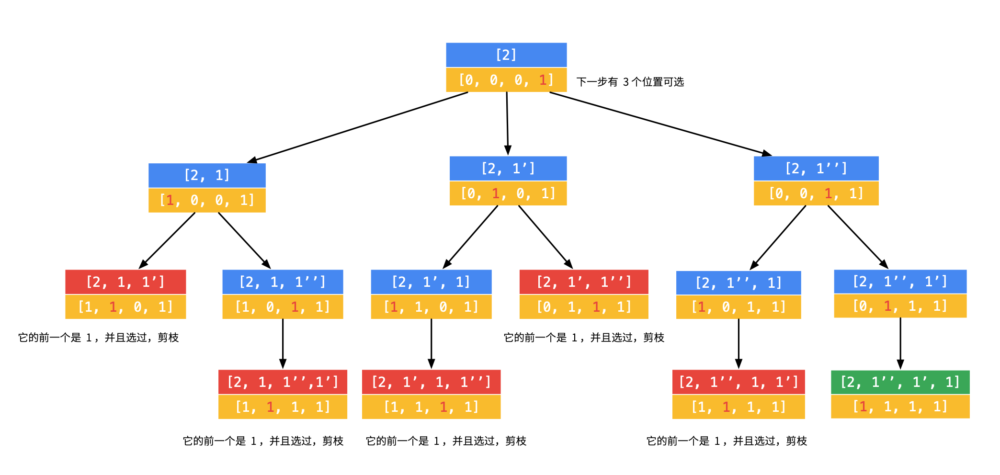

思路：在一定会产生重复结果集的地方剪枝。

一个比较容易想到的办法是在结果集中去重。但是问题又来了，这些结果集的元素是一个又一个列表，对列表去重不像用哈希表对基本元素去重那样容易。




产生重复结点的地方，正是图中标注了“剪刀”，且被绿色框框住的地方。

大家也可以把第 2 个 1 加上 ' ，即 [1, 1', 2] 去想象这个搜索的过程。只要遇到起点一样，就有可能产生重复。这里还有一个很细节的地方：

1. 在图中 2 处，搜索的数也和上一次一样，但是上一次的 1 还在使用中；
2. 在图中 1 处，搜索的数也和上一次一样，但是上一次的 1 刚刚被撤销，正是因为刚被撤销，下面的搜索中还会使用到，因此会产生重复，剪掉的就应该是这样的分支。


代码：

```java
if (i > 0 && nums[i] == nums[i - 1] && !used[i - 1]) {
    continue;
}
```
这段代码就能检测到标注为 1 的两个结点，跳过它们。注意：这里 used[i - 1] 不加 !，测评也能通过。


如果剪枝写的是：

```java
if (i > 0 && nums[i] == nums[i - 1] && !used[i - 1]) {
    continue;
}
```
那么，对于数组 `[1, 1', 1'', 2]`，回溯的过程如下



得到的全排列是：`[[1, 1', 1'', 2], [1, 1', 2, 1''], [1, 2, 1', 1''], [2, 1, 1', 1'']]`。特点是：`1、1'、1''` 出现的顺序只能是 `1、1'、1''`。

如果剪枝写的是：

```java
if (i > 0 && nums[i] == nums[i - 1] && used[i - 1]) {
    
    continue;
}
```

那么，对于数组 `[1, 1’, 1’’, 2]`，回溯的过程如下（因为过程稍显繁琐，所以没有画在一张图里）：
- 先选第 1 个数字，有 4 种取法。

    

- 对第 1 步的第 1 个分支，可以继续搜索，但是发现，没有搜索到合适的叶子结点。

    

- 对第 1 步的第 2 个分支，可以继续搜索，但是同样发现，没有搜索到合适的叶子结点。
  
    

- 对第 1 步的第 3 个分支，继续搜索发现搜索到合适的叶子结点。

    

- 对第 1 步的第 4 个分支，继续搜索发现搜索到合适的叶子结点。

    

因此，used[i - 1] 前面加不加感叹号的区别仅在于保留的是相同元素的顺序索引，还是倒序索引。很明显，顺序索引（即使用 !used[i - 1] 作为剪枝判定条件得到）的递归树剪枝更彻底，思路也相对较自然。

```java
public class Solution {
    public List<List<Integer>> permuteUnique(int[] nums) {
        List<List<Integer>> res = new ArrayList<List<Integer>>();
        if(nums==null || nums.length==0) return res;
        boolean[] used = new boolean[nums.length];
        List<Integer> list = new ArrayList<Integer>();
        Arrays.sort(nums);
        dfs(nums, used, list, res);
        return res;
    }

    public void dfs(int[] nums, boolean[] used, List<Integer> list, List<List<Integer>> res){
        if(list.size()==nums.length){
            res.add(new ArrayList<Integer>(list));
            return;
        }
        for(int i=0;i<nums.length;i++){
            if(used[i]) continue;
            if(i>0 &&nums[i-1]==nums[i] && !used[i-1]) continue;
            used[i]=true;
            list.add(nums[i]);
            dfs(nums,used,list,res);
            used[i]=false;
            list.remove(list.size()-1);
        }
    }
}
```