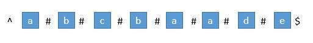
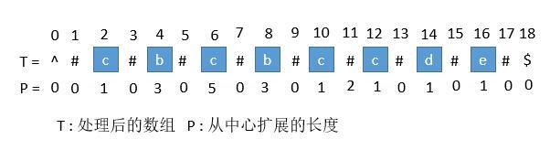
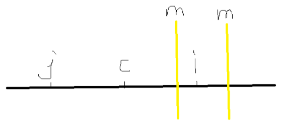
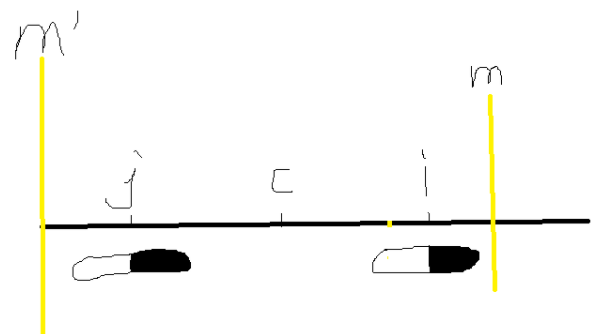

我们知道回文串一定是对称的，所以我们可以每次循环选择一个中心，进行左右扩展，判断左右字符是否相等即可。

```java
public class Solution {
    private int lo, maxLen;

    public String longestPalindrome(String s) {
        int len = s.length();
        if (len < 2)
            return s;

        for (int i = 0; i < len-1; i++) {
            extendPalindrome(s, i, i);  //assume odd length, try to extend Palindrome as possible
            extendPalindrome(s, i, i+1); //assume even length.
        }
        return s.substring(lo, lo + maxLen);
    }

    private void extendPalindrome(String s, int j, int k) {
        while (j >= 0 && k < s.length() && s.charAt(j) == s.charAt(k)) {
            j--;
            k++;
        }
        if (maxLen < k - j - 1) {
            lo = j + 1;
            maxLen = k - j - 1;
        }
    }
}
```

# DP

```java
public class Solution {
    public static String longestPalindrome(String s) {
        int n = s.length();
        String res = null;
        int palindromeStartsAt = 0, maxLen = 0;

        boolean[][] dp = new boolean[n][n];
        // dp[i][j] indicates whether substring s starting at index i and ending at j is palindrome
        
        for(int i = n-1; i >= 0; i--) { // keep increasing the possible palindrome string
            for(int j = i; j < n; j++) { // find the max palindrome within this window of (i,j)
                
                //check if substring between (i,j) is palindrome
                dp[i][j] = (s.charAt(i) == s.charAt(j)) // chars at i and j should match
                           && 
                           ( j-i < 3  // if window is less than or equal to 3, just end chars should match
                             || dp[i+1][j-1]  ); // if window is > 3, substring (i+1, j-1) should be palindrome too
                
                //update max palindrome string
                if(dp[i][j] && (j-i+1 > maxLen)) {
                    palindromeStartsAt = i;
                    maxLen = j-i+1;
                }
            }
        }
        return s.substring(palindromeStartsAt, palindromeStartsAt+maxLen);
    }
}
```

# Manacher‘s Algorithm

马拉车算法 Manacher‘s Algorithm 是用来查找一个字符串的最长回文子串的线性方法，由一个叫Manacher的人在1975年发明的，这个方法的最大贡献是在于将时间复杂度提升到了线性。

首先我们解决下奇数和偶数的问题，在每个字符间插入"#"，并且为了使得扩展的过程中，到边界后自动结束，在两端分别插入 "^" 和 "$"，两个不可能在字符串中出现的字符，这样中心扩展的时候，判断两端字符是否相等的时候，如果到了边界就一定会不相等，从而出了循环。经过处理，字符串的长度永远都是奇数了。



首先我们用**一个数组 P 保存从中心扩展的最大个数，而它刚好也是去掉 "#" 的原字符串的总长度**。例如下图中下标是 6 的地方。可以看到 `P[6]` 等于 5，所以它是从左边扩展 5 个字符，相应的右边也是扩展 5 个字符，也就是 "`#c#b#c#b#c#`"。而去掉 # 恢复到原来的字符串，变成 "cbcbc"，它的长度刚好也就是 5。



## 求原字符串下标

用P的下标`i`减去`P[i]`，再除以2，就是源字符串的开头下标了。

> 例如我们找到`P[i]`的最大值是5，也就是回文串的最大长度是5，对应的下标是6，所以源字符串的开头下标是$(6-5)/2=0$。

## 求每个`P[i]`

### 中心扩散法

记录以当前字符为中心，向左右两边同时扩散，记录能够扩散的最大步数。

```c++
class Solution {
public:
    string longestPalindrome(string s) {
        vector<char> vec;
        vec.push_back('^');
        vec.push_back('#');

        for (char c : s) {
            vec.push_back(c);
            vec.push_back('#');
        }

        vec.push_back('$');
        vector<unsigned int> p(vec.size(), 0);

        for (int i = 0; i < vec.size(); i++) {
            expand(vec, p, i);
        }

        size_t max_cnt = 0;
        size_t max_index = 0;

        for (int i = 0; i < p.size(); i++) {
            if (max_cnt < p[i]) {
                max_cnt = p[i];
                max_index = i;
            }
        }

        return s.substr((max_index-max_cnt)/2, max_cnt);
    }

    void expand(const vector<char> &vec, vector<unsigned int> &p, const int index) {
        int i = 1;
        int cnt = 0;
        while (index - i >= 0 && index + i < vec.size()) {
            if (vec[index - i] == vec[index + i]) {
                cnt++;
                i++;
            }
            else {
                break;
            }
        }
        p[index] = cnt;
    }
};

```

### Mancher's Algorithm

**如果要求`p[i]`，那么我们一定已经知道了小于i的所有值（也就是说如果`j<i`，那么`p[j]`一定知道了，并且是个不会再变的值），而且，还要利用之前的`p[j]`去求`p[i]`。**



解释：

- `i`是目前要求的中心的位置，即目前要求`p[i]`
- `m`是从`p[0]+0`到`p[i-i]+i-1`这i个值中最大的那个，可能在i左边，也可能在i右边，不确定
- `c`是`m`对应的位置，即`p[c]+c=m`
- `j`和`i`关于c对称。

下面是核心逻辑

- 如果`m`在`i`左边，则直接以i为中心，向两边扩展，得到`p[i]`。这里不需要之前的值

- 如果`m`在`i`右边，显然以`c`为中心的回文串包含了`i`位置

  

  - 如果`p[j]+i`没有超过`m`，因为`i`与`j`关于c对称，则`p[i]`最小有`p[j]`这么大（假设`p[i]=p[j]`）
  - 如果`p[j]+i`超过了`m`，那么只能确定`p[i]`至少有`m-i`这么长，之后的字符超过了`p[c]`的范围（`m'`左边的和`m`右边的不对称），需要重新检查。

  所以`p[i]`的值要么是`m-i`要么是`p[j]`，哪个小取哪个。

```c++
class Solution {
public:
    string longestPalindrome(string s) {
        string t = "^#";
        for (int i = 0; i < s.size(); ++i) {
            t += s[i];
            t += "#";
        }
        t += "$";
        // Process t
        vector<int> p(t.size(), 0);
        int mx = 0, id = 0, resLen = 0, resCenter = 0;
        for (int i = 1; i < t.size(); ++i) {
            p[i] = mx > i ? min(p[2 * id - i], mx - i) : 1;
            while (t[i + p[i]] == t[i - p[i]]) ++p[i];
            if (mx < i + p[i]) {
                mx = i + p[i];
                id = i;
            }
            if (resLen < p[i]) {
                resLen = p[i];
                resCenter = i;
            }
        }
        return s.substr((resCenter - resLen) / 2, resLen - 1);
    }
};
```

