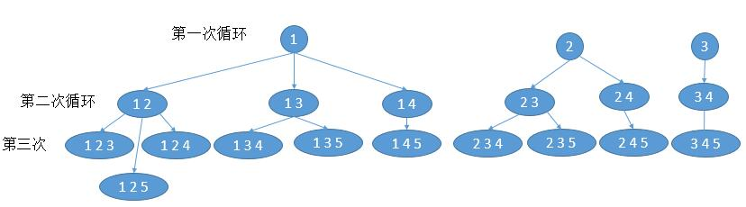

# 自己写的

```java
class Solution {
    private int n, k;
    private List<List<Integer>> result = new LinkedList<>();
    public List<List<Integer>> combine(int _n, int _k) {
        n = _n;
        k = _k;
        helper(1, k, new LinkedList<Integer>());
        return result;
    }

    private void helper(int start, int left, List<Integer> combination) {
        if (combination.size() == k) {
            result.add(combination);
        }
        for (int i = start; i <= n; i++) {
            List<Integer> comb = new LinkedList<>();
            comb.addAll(combination);
            comb.add(i);
            helper(i + 1, left-1, comb);
        }
    }
}
```

# 题解

没有必要每次新建：

```java
class Solution {
    private int n, k;
    private List<List<Integer>> result = new LinkedList<>();
    public List<List<Integer>> combine(int _n, int _k) {
        n = _n;
        k = _k;
        helper(1, k, new LinkedList<Integer>());
        return result;
    }

    private void helper(int start, int left, List<Integer> combination) {
        if (combination.size() == k) {
            result.add(new LinkedList<>(combination));
        }
        for (int i = start; i <= n; i++) {
            combination.add(i);
            helper(i + 1, left-1, combination);
            combination.remove(combination.size() - 1);
        }
    }
}
```

效率高一点

for 循环里 i 从 start 到 n，其实没必要到 n。比如，n = 5，k = 4，temp.size( ) = 1，此时代表我们还需要（4 - 1 = 3）个数字，如果 i = 4 的话，以后最多把 4 和 5 加入到 temp 中，而此时 temp.size() 才等于 1 + 2 = 3，不够 4 个，所以 i 没必要等于 4，i 循环到 3 就足够了。

所以 for 循环的结束条件可以改成， `i <= n - (k - temp.size()) + 1`，`k - temp.size()` 代表我们还需要的数字个数。因为我们最后取到了 n，所以还要加 1。

```java
class Solution {
    private int n, k;
    private List<List<Integer>> result = new LinkedList<>();
    public List<List<Integer>> combine(int _n, int _k) {
        n = _n;
        k = _k;
        helper(1, k, new LinkedList<Integer>());
        return result;
    }

    private void helper(int start, int left, List<Integer> combination) {
        if (combination.size() == k) {
            result.add(new LinkedList<>(combination));
        }
        // k - combination.size() 表示还需要多少个元素
        for (int i = start; i <= n - (k - combination.size()) + 1; i++) {
            combination.add(i);
            helper(i + 1, left-1, combination);
            combination.remove(combination.size() - 1);
        }
    }
}
```

## 迭代

回溯的思想改成迭代。回溯其实有三个过程。
- for 循环结束，也就是 i == n + 1，然后回到上一层的 for 循环
- temp.size() == k，也就是所需要的数字够了，然后把它加入到结果中。
- 每个 for 循环里边，进入递归，添加下一个数字

```java
public List<List<Integer>> combine(int n, int k) {
    List<List<Integer>> ans = new ArrayList<>();
    List<Integer> temp = new ArrayList<>();
    for(int i = 0;i<k;i++){
        temp.add(0);
    }
    int i = 0;
    while (i >= 0) {
        temp.set(i, temp.get(i)+ 1); //当前数字加 1
        //当前数字大于 n，对应回溯法的 i == n + 1，然后回到上一层
        if (temp.get(i) > n) {
            i--;
        // 当前数字个数够了
        } else if (i == k - 1) { 
            ans.add(new ArrayList<>(temp));
        //进入更新下一个数字
        }else {
            i++;
            //把下一个数字置为上一个数字，类似于回溯法中的 start
            temp.set(i, temp.get(i-1));
        }
    }
    return ans;
}
```

## 迭代2

参考46题，找 k 个数，我们可以先找出 1 个的所有结果，然后在 1 个的所有结果再添加 1 个数，变成 2 个，然后依次迭代，直到有 k 个数。


- 第 1 次循环，我们找出所有 1 个数的可能 [ 1 ]，[ 2 ]，[ 3 ]。4 和 5 不可能，因为总共需要 3 个数，4，5 全加上才 2 个数。
- 第 2 次循环，在每个 list 添加 1 个数， [ 1 ] 扩展为 [ 1 , 2 ]，[ 1 , 3 ]，[ 1 , 4 ]。[ 1 , 5 ] 不可能，因为 5 后边没有数字了。 [ 2 ] 扩展为 [ 2 , 3 ]，[ 2 , 4 ]。[ 3 ] 扩展为 [ 3 , 4 ]；
- 第 3 次循环，在每个 list 添加 1 个数， [ 1，2 ] 扩展为[ 1，2，3]， [ 1，2，4]， [ 1，2，5]；[ 1，3 ] 扩展为 [ 1，3，4]， [ 1，3，5]；[ 1，4 ] 扩展为 [ 1，4，5]；[ 2，3 ] 扩展为 [ 2，3，4]， [ 2，3，5]；[ 2，4 ] 扩展为 [ 2，4，5]；[ 3，4 ] 扩展为 [ 3，4，5]；
- 最后结果就是，[[ 1，2，3]， [ 1，2，4]， [ 1，2，5]，[ 1，3，4]， [ 1，3，5]， [ 1，4，5]， [ 2，3，4]， [ 2，3，5]，[ 2，4，5]， [ 3，4，5]]。

上边分析很明显了，三个循环，第一层循环是 1 到 k ，代表当前有多少个数。第二层循环就是遍历之前的所有结果。第三次循环就是将当前结果扩展为多个。
```java
public List<List<Integer>> combine(int n, int k) {
    if (n == 0 || k == 0 || k > n) return Collections.emptyList();
    List<List<Integer>> res = new ArrayList<List<Integer>>();
    //个数为 1 的所有可能
    for (int i = 1; i <= n + 1 - k; i++) res.add(Arrays.asList(i));
    //第一层循环，从 2 到 k
    for (int i = 2; i <= k; i++) {
        List<List<Integer>> tmp = new ArrayList<List<Integer>>();
        //第二层循环，遍历之前所有的结果
        for (List<Integer> list : res) {
            //第三次循环，对每个结果进行扩展
            //从最后一个元素加 1 开始，然后不是到 n ，而是和解法一的优化一样
            //(k - (i - 1） 代表当前已经有的个数，最后再加 1 是因为取了 n
            for (int m = list.get(list.size() - 1) + 1; m <= n - (k - (i - 1)) + 1; m++) {
                List<Integer> newList = new ArrayList<Integer>(list);
                newList.add(m);
                tmp.add(newList);
            }
        }
        res = tmp;
    }
    return res;
}
```

## 递归

基于公式

```math
C ( n, k ) = C ( n - 1, k - 1) + C ( n - 1, k ) 
```

从 n 个数字选 k 个，我们把所有结果分为两种，包含第 n 个数和不包含第 n 个数。这样的话，就可以把问题转换成
- 从 n - 1 里边选 k - 1 个，然后每个结果加上 n
- 从 n - 1 个里边直接选 k 个。

```java
public List<List<Integer>> combine(int n, int k) {
    if (k == n || k == 0) {
        List<Integer> row = new LinkedList<>();
        for (int i = 1; i <= k; ++i) {
            row.add(i);
        }
        return new LinkedList<>(Arrays.asList(row));
    }
    // n - 1 里边选 k - 1 个
    List<List<Integer>> result = combine(n - 1, k - 1);
    //每个结果加上 n
    result.forEach(e -> e.add(n));
    //把 n - 1 个选 k 个的结果也加入
    result.addAll(combine(n - 1, k));
    return result;
}
```

## 动态规划

```java
public List<List<Integer>> combine(int n, int k) { 
    List<List<Integer>>[][] dp = new List[n + 1][k + 1];
    //更新 k = 0 的所有情况
    for (int i = 0; i <= n; i++) {
        dp[i][0] = new ArrayList<>();
        dp[i][0].add(new ArrayList<Integer>());
    }
    // i 从 1 到 n
    for (int i = 1; i <= n; i++) {
        // j 从 1 到 i 或者 k
        for (int j = 1; j <= i && j <= k; j++) { 
            dp[i][j] = new ArrayList<>();
            //判断是否可以从 i - 1 里边选 j 个
            if (i > j){
                dp[i][j].addAll(dp[i - 1][j]);
            } 
            //把 i - 1 里边选 j - 1 个的每个结果加上 i
            for (List<Integer> list: dp[i - 1][j - 1]) {
                List<Integer> tmpList = new ArrayList<>(list);
                tmpList.add(i);
                dp[i][j].add(tmpList);
            } 
        }
    }
    return dp[n][k];
}
```
